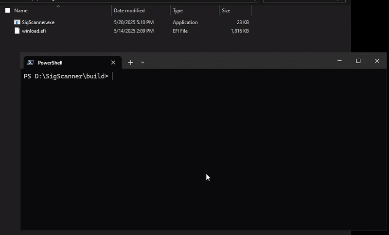

# SigScanner
A simple PE function signature dumper written in C11 with no external dependencies.

## Usage
```
Usage: %s <pePath> <functionName> <sigLength>
```
`pePath` - the path to your PE file <br>
`functionName` - the name of the function you want signature of <br>
`sigLength` - length of the signature <br>
All of the parameters are required.

## Demo


## How it works under the hood
1. Parses a PE image (e.g. `winload.efi`, `pcw.sys` etc.) to extract its CodeView debug directory
2. Downloads the matching PDB from the Microsoft symbol server
3. Uses DbgHelp to look up a named function's RVA in that PDB  
4. Maps the RVA back into the original PE file's raw bytes  
5. Dumps the first _N_ bytes (signature length) of that function as hexadecimal format (`0xAA, 0xBB, 0xFF...`)

---

## Building
This repository uses Meson. Make sure you have it installed in your system, if not then please refer to [this link](https://mesonbuild.com/Getting-meson.html).

Build the project by
```
meson setup build
```
It will create the build directory. Now compile the project with
```
meson compile -C build
```
You will find the executable file inside the build directory.

> If any reason you can't have Meson, then use the VS Developer Command Prompt to compile via `cl /W4 /DUNICODE /D_UNICODE /TC Main.c Pdb.c Signature.c Error.c /link DbgHelp.lib WinHttp.lib`.
